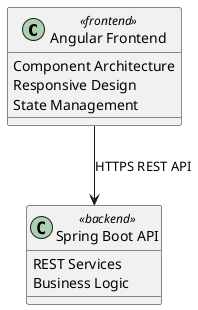

# Alternative Diagram Solutions for Myloc Agency Architecture

## The Problem with Matplotlib
- Poor arrow routing (overlaps and messy paths)
- Manual positioning required
- Not designed for architecture diagrams
- Limited professional layout options

## Recommended Solution: Mermaid.js

### Why Mermaid.js is Perfect:
1. **Clean Automatic Layout** - No overlapping arrows
2. **Professional Output** - Academic-grade diagrams  
3. **Easy Syntax** - Text-based, version controllable
4. **Multiple Export Formats** - PNG, SVG, PDF
5. **Great for LaTeX Integration** - High-quality outputs

### Mermaid Architecture Diagram Code:

```mermaid
graph TB
    subgraph "PRESENTATION LAYER"
        A[Angular Frontend<br/>Component Architecture<br/>Responsive Design<br/>State Management]
    end
    
    subgraph "APPLICATION SERVICES"  
        B[Spring Boot API<br/>REST Services<br/>Business Logic<br/>Security Integration]
        C[FastAPI Chatbot<br/>AI Assistant<br/>OpenAI Integration<br/>Real-time Chat] 
        D[Keycloak Identity<br/>OAuth2 Authentication<br/>JWT Tokens<br/>Role Management]
    end
    
    subgraph "DATA PERSISTENCE"
        E[MySQL Database<br/>User & Agency Data<br/>Vehicle Inventory<br/>Booking Records]
    end
    
    subgraph "INFRASTRUCTURE"
        F[Docker<br/>Containerization]
        G[Kubernetes<br/>Orchestration] 
        H[GitLab CI/CD<br/>Automation]
    end
    
    A -->|HTTPS REST API| B
    A -->|WebSocket Chat| C
    B -->|JPA/JDBC| E
    B <-->|OAuth2/JWT| D
    
    F --> G
    G --> H
    
    classDef frontend fill:#E3F2FD,stroke:#1976D2,stroke-width:2px
    classDef backend fill:#E8F5E8,stroke:#388E3C,stroke-width:2px  
    classDef ai fill:#FFF3E0,stroke:#F57C00,stroke-width:2px
    classDef auth fill:#F5F5F5,stroke:#757575,stroke-width:2px
    classDef database fill:#F3E5F5,stroke:#7C3AED,stroke-width:2px
    classDef infra fill:#F0F4FF,stroke:#1565C0,stroke-width:2px
    
    class A frontend
    class B backend
    class C ai  
    class D auth
    class E database
    class F,G,H infra
```

## How to Generate:

### Method 1: Online (Quick)
1. Go to https://mermaid.live
2. Paste the code above
3. Export as PNG/SVG (300 DPI)
4. Download for LaTeX

### Method 2: Command Line (Professional)
```bash
# Install Mermaid CLI
npm install -g @mermaid-js/mermaid-cli

# Generate high-quality PNG
mmdc -i architecture.mmd -o system-architecture.png -w 1200 -H 900 --scale 2

# Generate SVG  
mmdc -i architecture.mmd -o system-architecture.svg
```

### Method 3: VS Code Extension
1. Install "Mermaid Preview" extension
2. Create .mmd file with diagram code
3. Preview and export directly

## Alternative Solutions:

### 1. PlantUML (Text-based)


### 2. Draw.io Programmatic
- Use draw.io desktop app
- Export as high-quality PNG/SVG
- Maintain source .drawio files

### 3. SVG Generation (Full Control)
```python
svg_template = '''
<svg width="800" height="600" xmlns="http://www.w3.org/2000/svg">
  <rect x="50" y="50" width="200" height="100" 
        fill="#E3F2FD" stroke="#1976D2" rx="10"/>
  <text x="150" y="105" text-anchor="middle" 
        font-family="Arial" font-size="14">Angular Frontend</text>
</svg>
'''
```

## Recommendation for Your Project:

**Use Mermaid.js** - it solves all the issues:
- ✅ Clean, automatic arrow routing
- ✅ Professional grid-based layout  
- ✅ No overlapping elements
- ✅ Easy to modify and maintain
- ✅ Perfect for academic documents
- ✅ Exports high-quality images for LaTeX

The Mermaid syntax above will generate a clean, professional architecture diagram with proper spacing and routing that's perfect for your academic report.
